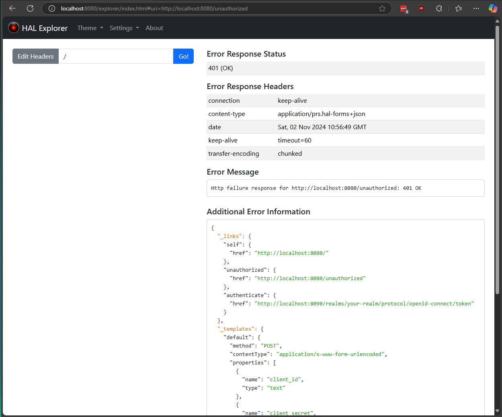
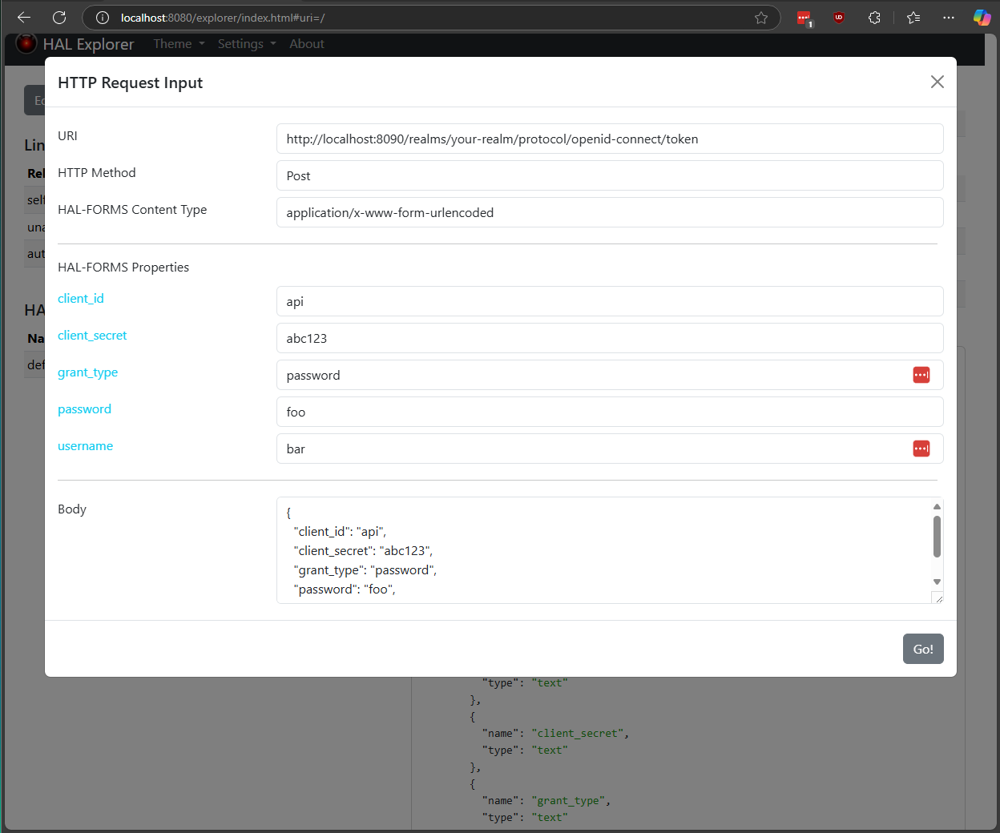

# HAL Explorer (with Spring Boot)

This is a small sample project that demonstrates two possible enhancements to the HAL Explorer after some
experimentation with Spring Boot + Keycloak + HAL Explorer.

<ol>
<li>
When is returned a 401 status code with content type application/prs.hal-forms+json and proper payload, the HAL
   Explorer will not display the Links and HAL-FORMS Template Elements sections on the left.

<details>
<summary>See the image.</summary>



</details>
</li>
<li>
The HTTP Request Input form could render properly the "Body" with the Content Type application/x-www-form-urlencoded.
   Currently, it is always rendered as json. Should be rendered as an url encoded string.

The expected result in the Body textarea would be:

```
client_id=api&client_secret=abc123&username=foo&password=bar&grant_type=password
```

<details>
<summary>See the image.</summary>



</details>

<details>
<summary>Api response payload.</summary>

```json
{
  "_links": {
    "self": {
      "href": "http://localhost:8080/"
    },
    "unauthorized": {
      "href": "http://localhost:8080/unauthorized"
    },
    "authenticate": {
      "href": "http://localhost:8090/realms/your-realm/protocol/openid-connect/token"
    }
  },
  "_templates": {
    "default": {
      "method": "POST",
      "contentType": "application/x-www-form-urlencoded",
      "properties": [
        {
          "name": "client_id",
          "type": "text"
        },
        {
          "name": "client_secret",
          "type": "text"
        },
        {
          "name": "grant_type",
          "type": "text"
        },
        {
          "name": "password",
          "type": "text"
        },
        {
          "name": "username",
          "type": "text"
        }
      ],
      "target": "http://localhost:8090/realms/your-realm/protocol/openid-connect/token"
    }
  }
}
```

</details>

</li>
</ol>

## How to Run

### Docker

<details>
<summary>Click to expand</summary>

Build the docker image.

```bash
docker build -t marciovmartins/hal-explorer-issue-1 .
```

Create and run the container.

```bash
docker run -p 8080:8080 marciovmartins/hal-explorer-issue-1
```

</details>

### Maven

<details>
<summary>Click to expand</summary>

In the command line run the following command.

```bash
mvn spring-boot:run
```

</details>